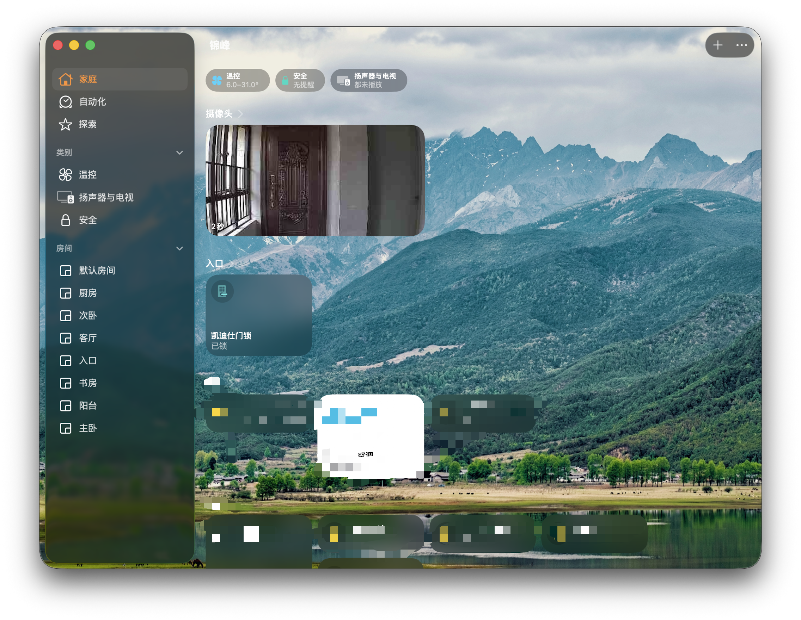
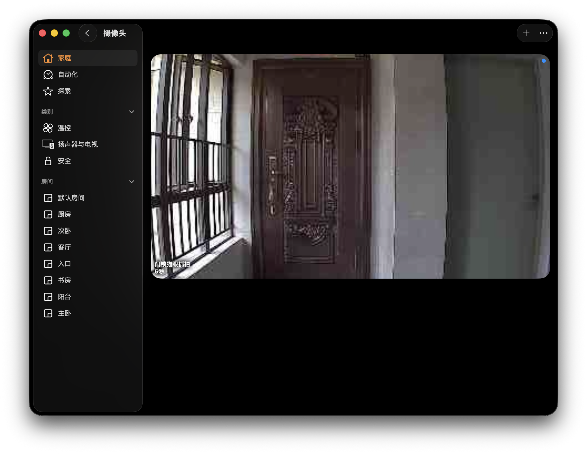
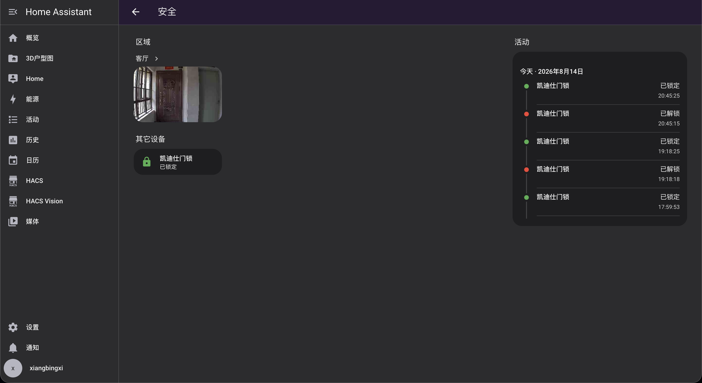
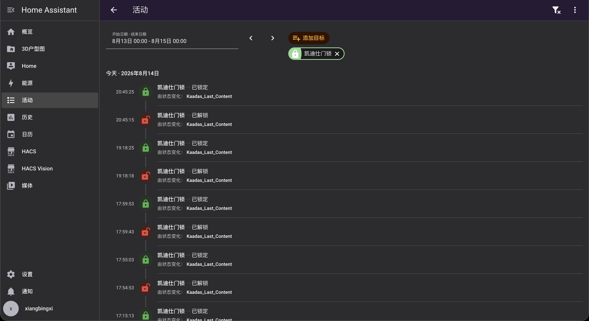
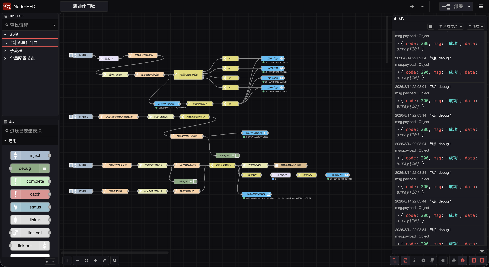

# Kaadas Smart Door Lock Integration for Home Assistant & Apple HomeKit (Node-RED)

[](https://opensource.org/licenses/MIT)
[](https://nodered.org/)
[](https://www.home-assistant.io/)
[](https://www.fnnas.com/)

[**简体中文文档**](./README.md)

---

Integrate Kaadas Smart Door Lock into **Home Assistant** and **Apple HomeKit** via Node-RED API polling. Features **lock status monitoring, battery reading, instant visitor doorbell snapshots, alarm snapshots, and native Apple device doorbell popup notifications**.

> 💡 **Notes**:
> 1. Tested and deployed via Docker on **fnOS (Feiniu OS)**.
> 2. API fields might differ across different Kaadas lock models. **Please refer to your own packet capture results for exact API parameters**.
> 3. The local snapshot save path (`/config/www/lock_latest.jpg`) must match the volume mounts between your Node-RED and Home Assistant containers.
> 4. **About HomeKit**: HomeKit Bridge configuration is completely optional. If you only use Home Assistant, you do not need to configure HomeKit.

---

## 📸 Showcase

### 1. Apple HomeKit Integration & Live Snapshots (Optional)
| Apple Home App Overview | Doorbell Camera View |
| :---: | :---: |
|  |  |
| *Fig 1: Real-time lock status and camera thumbnail in Apple Home* | *Fig 2: Full-screen view with auto-rotated 90° portrait snapshot* |

---

### 2. Home Assistant Dashboard & Activity Log
| HA Security Dashboard | Lock Activity History Log |
| :---: | :---: |
|  |  |
| *Fig 3: Home Assistant dashboard integrating lock state & snapshot* | *Fig 4: Real-time logging of lock/unlock events with user mappings* |

---

### 3. Node-RED Flow Topology

*Fig 5: Complete Node-RED flow covering Operation Logs, Lock Info, and the Dual-Track Snapshot Pipeline*

---

## 🌟 Acknowledgements & References

The foundational API polling and device info retrieval logic references the following open-source project and community discussion:
* GitHub Repository: [MF-142/kaadas](https://github.com/MF-142/kaadas)
* Hassbian Forum Thread: [Kaadas Smart Lock Integration (Node-RED) - Hassbian](https://bbs.hassbian.com/thread-24121-1-1.html)

Building upon that, this project introduces a significant architectural rewrite and adds a **Dual-Track Snapshot Pipeline with native HomeKit support**:
1. **Visitor Doorbell Snapshots**: Instantly captures and caches photos taken upon doorbell press.
2. **Security Alarm Snapshots**: Captures images upon 5 consecutive failed unlock attempts or tampering alarms.
3. **Aliyun OSS Image Auto-Rotation**: Corrects the physically horizontal orientation of Kaadas sensors by applying `?x-oss-process=image/rotate,90` to render normal portrait photos.
4. **Native Apple HomeKit Doorbell Notification**: Prompts full native banner notifications with live snapshots across iPhone, Apple Watch, Mac, and Apple TV.

---

## ✨ Features

- 🚪 **User Identification & Operation Logs**: Real-time sync of fingerprint/passcode/key unlock events, mapping to `User1`~`User4` entities and auto-resetting upon door lock.
- 🔋 **Battery & Lock Status**: Periodically updates battery percentage (`power`), Wi-Fi status, and firmware model to HA sensors.
- 🔔 **Instant Doorbell Snapshot**: Fast fetches cloud snapshots and automatically rotates them 90° clockwise.
- 🚨 **Security Alarm Catch**: Automatically downloads intruder snapshots when lock alerts are triggered.
- 🍎 **Native HomeKit Experience**: Native HomeKit doorbell popups powered by HA Generic Camera integration.

---

## 🛠️ Prerequisites

### 1. Home Assistant Setup
1. **Install Node-RED Companion**:
   * Install `Node-RED Companion` from HACS, then add and enable it in **Settings ➔ Devices & Services**.
2. **Configure Generic Camera**:
   * Add the following to `configuration.yaml` (or configure via **Settings ➔ Devices & Services ➔ Add Integration ➔ Generic Camera**):
     ```yaml
     camera:
       - platform: generic
         name: "Kaadas Doorbell Camera"
         still_image_url: "[http://127.0.0.1:8123/local/lock_latest.jpg](http://127.0.0.1:8123/local/lock_latest.jpg)"
         verify_ssl: false
     ```
3. **Configure HomeKit Bridge (Optional)**:
   * *Skip this if you do not use Apple HomeKit.*
   * In **Settings ➔ Devices & Services ➔ HomeKit Bridge**, link `binary_sensor.kaadas_doorbell` (device class `motion` or `doorbell`) with `camera.kaadas_doorbell_camera`.

---

### 2. Directory Mapping (Docker / fnOS)
Ensure the Home Assistant `www` directory is properly mounted to your Node-RED container:
* **Host / fnOS Path**: `/vol1/1000/docker/homeassistant/config/www`
* **Node-RED Container Mount**: `/config/www`
* **Note**: In the file output node, the default save path is set to `/config/www/lock_latest.jpg`.

---

### 3. Packet Capture Credentials
Capture the following credentials from the Kaadas mobile app using Stream / Thor / Charles:
* **`token`**: Request header authentication token (starts with `GR6qN8sz...`).
* **`wifiSN`**: Unique lock Wi-Fi serial number (e.g., `K2A12523...`).
* **`uid`**: User account ID (e.g., `6062767...`).

---

## 🚀 Quick Start

1. **Import Flow**:
   * Download [`flows-template.json`](./flows-template.json).
   * In Node-RED, click Top-Right Menu ➔ **Import** ➔ upload the JSON file.

2. **Fill in Credentials**:
   Edit the annotated function nodes with your actual credentials:
   * **Node `Get Lock Events`**: Replace `YOUR_KAADAS_TOKEN` & `YOUR_LOCK_WIFI_SN`.
   * **Node `Get Lock Info`**: Replace `YOUR_KAADAS_TOKEN` & `YOUR_KAADAS_UID`.
   * **Node `Visitor Request Settings`**: Replace `YOUR_KAADAS_TOKEN` & `YOUR_LOCK_WIFI_SN`.
   * **Node `Alarm Request Settings`**: Replace `YOUR_KAADAS_TOKEN` & `YOUR_LOCK_WIFI_SN`.
   * **Node `Push Snapshot to Mobile`** *(Optional)*: Replace `YOUR_HA_NOTIFY_SERVICE` (e.g., `mobile_app_iphone`).

3. **Link Home Assistant**:
   * Double-click any HA entity node, configure your Home Assistant server URL and Long-Lived Access Token.

4. **Deploy**:
   * Click **Deploy**. When nodes show green `connected` badges, your integration is live!

---

## 🏗️ Execution Architecture


```text
┌─────────────────────────────────────────────────────────────┐
│  [Visitor Doorbell /visit] ──► [Extract Snapshot] ──┐       │
│                                                     ├──► [Has Image?]
│  [Security Alarm /alarm]   ──► [Extract Snapshot] ──┘        │
└───────────────────────────────────────────────────────────────┼─────┘
                                                                ▼
┌─────────────────────────────────────────────────────────────────────┐
│ 1. [Download Photo] ➔ Auto-rotate 90° ➔ Overwrite to /config/www/lock_latest.jpg
│ 2. [Set ON] ➔ Trigger Doorbell Sensor ➔ Delay 2s ➔ [Set OFF]
│ 3. [HomeKit Integration] ➔ Native Doorbell Popup with Live Snapshot!
└─────────────────────────────────────────────────────────────────────┘
